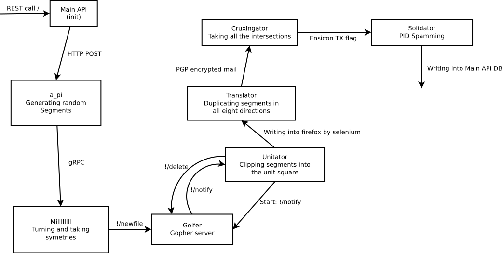

# Micro-Tiling

[](https://micro-tiling.readthedocs.io/en/latest/?badge=latest)

An API capable of generating mosaics, based on micro services.


The micro-services that make up this API use esoteric protocols to communicate with each other. One example is the Ensicoin. A running API is on `https://micro-tiling.tk/`. The documentation is availaible as a [html file](swagger_api/index.html).

If you want to generate a mosaic, you can read the Getting Started section below.

There is a python client library to use the REST api, but it does not handle the fee payment as of now.



## Getting Started

To generate a mosaic, you have two solutions. Use the python client, or communicate directly with the API.

### Using the API

We recommend that you install [httpie](https://github.com/jakubroztocil/httpie) to follow this guide.

To request the creation of a job, it is simply required to make a POST request on the root of the API.

```sh
http POST https://micro-tiling.tk
```

Normally, the API should respond with a job ID. For example, 0ca85c2d-0fbb-4237-898e-0ede992e5667. You can use this ID to track the status of the job:

```sh
http GET https://micro-tiling.tk/<id>/state
```

Since some services are developed in brainfuck, and because of the protocols used, some steps take a considerable amount of time to complete (several minutes).
After a while, the state will change to cruxingator_waiting_fees. This means that micro-tiling needs Ensicoins in order to send the transaction containing the segments of the mosaic.
Thus, you must send some Ensicoins to micro-tiling. First of all, you need to retrieve the Ensicoin address associated with your job:

```sh
http GET https://micro-tiling.tk/<id>/address
```

Then, you must use an Ensicoin wallet to make the payment. For example, you can install [ensicoincoin-cli](https://github.com/EnsicoinDevs/ensicoincoin-cli):

```sh
go get github.com/EnsicoinDevs/ensicoincoin-cli
```

You must then obtain Ensicoins. Fortunately, the coinbases are currently all expendable. You can therefore go to an Ensicoin block explorer, for example [Ensicoin Explorer](https://explorer.ensicoin.tk/). Then, you can choose a block, preferably a recent one, and copy the hash of its first transaction. You can now make the payment:

```sh
ensicoincoin-cli sendto --outpointhash <coinbase_hash> --pubkey <job_address> --value 42
```

Very quickly, the status of the job should change. You can now wait until the job is finished, then get your beautiful mosaic:

```sh
http GET https://micro-tiling.tk/<id>/result
```

### Using the library


## Deployment

Deploying your own cluster is not easy. You must have a functional Kubernetes cluster. Then, you must deploy the files in the [deployment folder](deployment).

## Built With

* [Ensicoin](https://github.com/EnsicoinDevs/ensicoin) - An experimental cryptocurrency
* [Docker](https://www.docker.com/) - A container platform
* [Brainfuck](https://en.wikipedia.org/wiki/Brainfuck) - An esoteric programming language

## Contributing

Please read [CONTRIBUTING.md](CONTRIBUTING.md) for details on our code of conduct, and the process for submitting pull requests to us.

## Versioning

We use [SemVer](http://semver.org/) for versioning. For the versions available, see the [tags on this repository](https://github.com/traxys/micro-tiling/tags). 

## Authors

* **Aurélien Moisson-franckhauser** - *brainfuck development and Solidator swarm* [aurelienMoisson](https://github.com/aurelienMoisson)
* **Johyn Papin** - *Initial work* - [johynpapin](https://github.com/johynpapin)
* **Quentin Boyer** - *Initial work* - [traxys](https://github.com/traxys)

See also the list of [contributors](https://github.com/traxys/micro-tiling/contributors) who participated in this project.

## License

This project is licensed under the GPL-3.0 License - see the [LICENSE.md](LICENSE.md) file for details

## Acknowledgments

* Our BPI teacher, Mr. Frédéric Wagner, for this wonderful subject.
